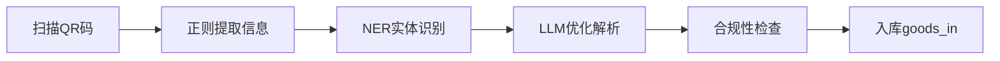
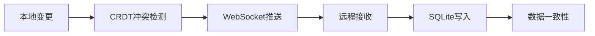
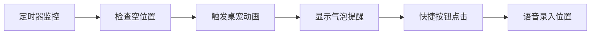
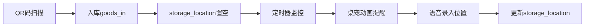

# AI研发助手 - 项目架构文档

## 角色分工

### 1. 全栈开发（Electron/Flutter）
**职责**：
- Flutter跨平台开发（Windows/Android）
- UI/UX设计，动画实现
- 桌面端特殊配置（无边框窗口、系统托盘）
- Android端特殊配置（悬浮窗权限、后台服务）

**交付物**：
- Windows端：透明小猫桌宠，可拖拽，无边框窗口，系统托盘
- Android端：主屏幕小部件，点击交互，后台服务保持同步

**技术栈**：
- Flutter框架
- Riverpod状态管理
- Lottie动画
- bitsdojo_window、window_manager、system_tray（Windows）
- flutter_window_manager（Android）

### 2. 后端/同步算法工程师（WebSocket, CRDT, SQLite调优）
**职责**：
- WebSocket通信架构
- CRDT数据同步算法
- SQLite数据库设计和优化
- 多端数据同步机制

**交付物**：
- WebSocket服务器
- CRDT同步引擎
- SQLite数据库优化方案
- 实时数据同步解决方案

**技术栈**：
- WebSocket、Dio
- CRDT算法
- SQLite、Drift数据库
- 数据一致性保障

### 3. AI工程师（LLM部署、NER、合规模型）
**职责**：
- QR码识别和信息提取
- NER命名实体识别
- LLM部署和模型优化
- 合规性检查和模型验证

**交付物**：
- QR码扫描解析系统
- NER实体识别服务
- LLM模型集成
- 合规性检查模型

**技术栈**：
- JSQR（桌面端）
- mobile_scanner（移动端）
- LLM推理（OpenAI/本地部署）
- NER模型训练

### 4. 产品/项目经理（兼测试、实验室流程顾问）
**职责**：
- 项目进度管理
- 测试方案设计
- 实验室流程规划
- 质量保证和验收标准

**交付物**：
- 项目进度计划
- 测试套件
- 实验室流程文档
- 验收标准文档

**技术栈**：
- 项目管理工具
- 测试框架
- 质量保证流程

## 核心功能流程

### 1. QR码扫描流程


### 2. 后端同步流程


### 3. 提醒机制流程


### 4. 端到端流程


## 技术架构

### 数据库设计
```sql
-- goods_in表（入库记录）
CREATE TABLE goods_in (
    id INTEGER PRIMARY KEY AUTOINCREMENT,
    goods_name TEXT NOT NULL,
    quantity INTEGER NOT NULL,
    price DECIMAL(10,2),
    arrival_date TIMESTAMP DEFAULT CURRENT_TIMESTAMP,
    supplier TEXT,
    notes TEXT,
    qrcode_data TEXT,
    storage_location TEXT -- 初始为NULL
);

-- inventory表（库存）
CREATE TABLE inventory (
    id INTEGER PRIMARY KEY AUTOINCREMENT,
    goods_id INTEGER NOT NULL,
    goods_name TEXT NOT NULL,
    current_quantity INTEGER NOT NULL DEFAULT 0,
    min_quantity INTEGER NOT NULL DEFAULT 0,
    max_quantity INTEGER NOT NULL DEFAULT 1000,
    location TEXT,
    last_update TIMESTAMP DEFAULT CURRENT_TIMESTAMP
);
```

### WebSocket同步
- 客户端推送本地变更
- 服务器合并和分发
- CRDT冲突解决
- 最终一致性保障

### AI模型部署
- QR码解析（正则+LLM）
- NER实体识别
- 合规性验证
- 语音输入处理

## 多端配置差异

### Windows端
- **bitsdojo_window**: 无边框窗口，窗口管理器
- **window_manager**: 窗口透明穿透，置顶窗口
- **system_tray**: 系统托盘，快捷菜单
- **开机自启**: Windows注册表配置

### Android端
- **SYSTEM_ALERT_WINDOW权限**: 悬浮窗权限申请
- **后台服务**: WebSocket连接保持
- **自动唤醒**: 设备唤醒机制
- **功耗优化**: 后台服务功耗控制

## 可交付物清单

### 基础交付物
1. Flutter项目脚手架
2. Windows端透明小猫桌宠
3. Android端简洁小部件
4. QR码扫描解析模块
5. 数据库CRDT同步引擎

### 核心功能交付物
1. 商品入库流程
2. 空位置提醒机制
3. 语音录入位置功能
4. WebSocket同步服务
5. AI模型集成

### 测试交付物
1. Windows端测试用例
2. Android端测试用例
3. 数据库同步测试
4. AI模型测试
5. 端到端流程测试

## 开发计划

### 第1周：项目脚手架
- Flutter项目创建
- 多平台配置（Windows/Android）
- 基础依赖引入
- 数据库和WebSocket架构设计

### 第2周：桌面端实现
- Windows无边框窗口
- Android悬浮窗权限
- 桌宠动画和交互
- 系统托盘和后台服务

### 第3周：后端同步
- SQLite数据库设计
- CRDT同步算法实现
- WebSocket通信框架
- 定时监控提醒机制

### 第4周：AI模型集成
- QR码解析正则规则
- NER实体识别模型
- LLM部署和优化
- 合规性检查模型

### 第5周：端到端流程
- QR码扫描入库流程
- 空位置监控提醒
- 语音录入位置
- 数据同步验证

### 第6周：测试和优化
- Windows端测试
- Android端测试
- 同步性能优化
- AI模型验证

### 第7周：部署和发布
- Windows安装包
- Android APK包
- 配置文档完善
- 用户手册编写

## 质量保证

### 测试方案
- 单元测试：各模块功能测试
- 集成测试：端到端流程测试
- 性能测试：数据库和同步性能
- 兼容性测试：Windows/Android兼容性

### 实验室流程
- 需求分析阶段
- 设计和开发阶段
- 测试和验证阶段
- 部署和发布阶段

### 验收标准
- Windows端桌宠正常运行
- Android端小部件正常显示
- QR码扫描解析成功率 > 95%
- 数据同步延迟 < 1秒
- AI模型准确率 > 90%